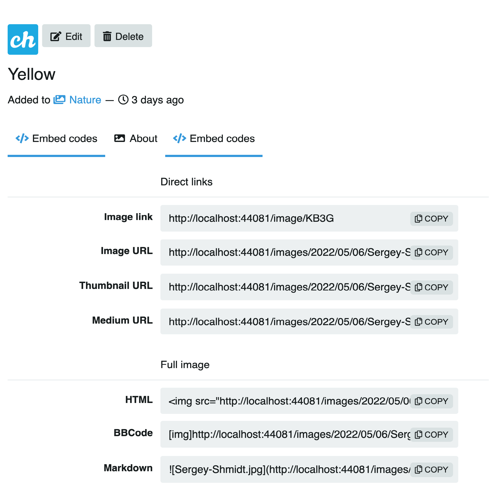
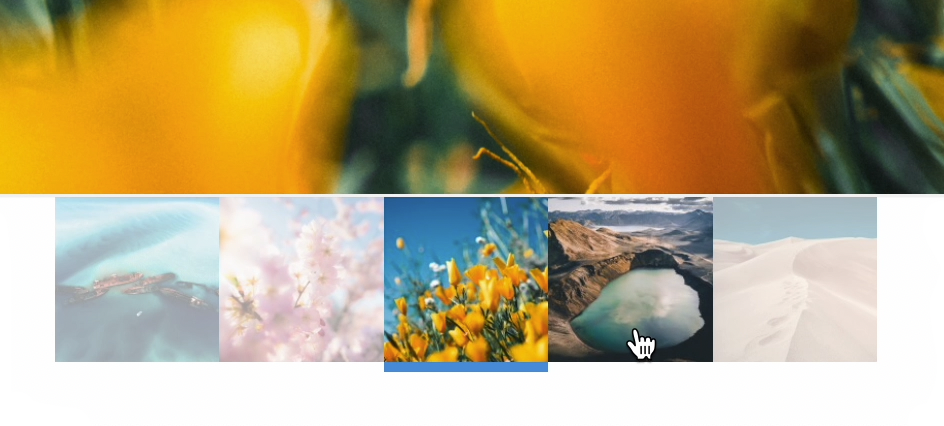

# Media

The media page displays a file at full width along with its metadata, embed codes, and action buttons.

## Metadata

Below the media you will find:

* **Title** — the media name
* **Dimensions, format and file size** — e.g. `1429 × 636 — JPG 154.6 KB`
* **Uploaded to** — the category it belongs to, how long ago it was uploaded, and the view count

## Action buttons

The buttons on the right side below the media are:

| Button   | Description                                                        |
| -------- | ------------------------------------------------------------------ |
| Edit     | Open the edit form (requires [Login](../../user/account/login.md)) |
| Delete   | Delete the media (requires [Login](../../user/account/login.md))   |
| Download | Download the original file                                         |
| Share    | Open the share dialog                                              |
| Like     | Like or unlike the media                                           |

## Tabs

### About

Shows the media description. If no description was provided at upload time, it reads "No description provided."

### Embed codes

Provides ready-to-copy codes to embed or link the media elsewhere. Codes are available in four formats:

| Format   | Options                                                           |
| -------- | ----------------------------------------------------------------- |
| Link     | Viewer link, Direct link, Frame link, Thumbnail link, Medium link |
| HTML     | Embed, Full linked, Medium linked, Thumbnail linked               |
| Markdown | Full, Full linked, Medium linked, Thumbnail linked                |
| BBCode   | Full, Full linked, Medium linked, Thumbnail linked                |

### Info

Shows technical metadata about the file.

## Editing

Requires [Login](../../user/account/login.md). Click the **Edit** button to open the edit form:

* **Title** — optional display name
* **Tags** — optional comma-separated tags
* **Album** — assign to one of your albums
* **Category** — assign to a site category
* **Flag not safe** — mark the media as NSFW
* **Description** — optional text description

## Album thumbnails

When the media belongs to an album, thumbnails of the other items in that album are displayed at the bottom of the page. Click any thumbnail to navigate to it.

