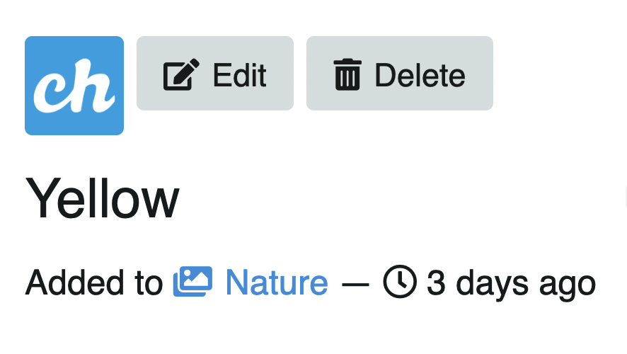
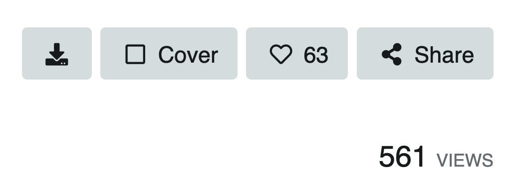

# Image

## Information and editing

Below the photo on the left, you will find the image title, the album it belongs to, and how long ago it was uploaded.

### Album content thumbnails

Images that belong to the same album are displayed as thumbnails grouped at the bottom of the image. You can navigate through the album images by clicking on the thumbnails.

## Download, share and more

Below the image on the right you will find the buttons:

* Download image
* Album cover
* Like
* Share
kv
A little further down the number of views:

## Direct links/URLs

Below the information you will find the direct links and more **About** the image.

