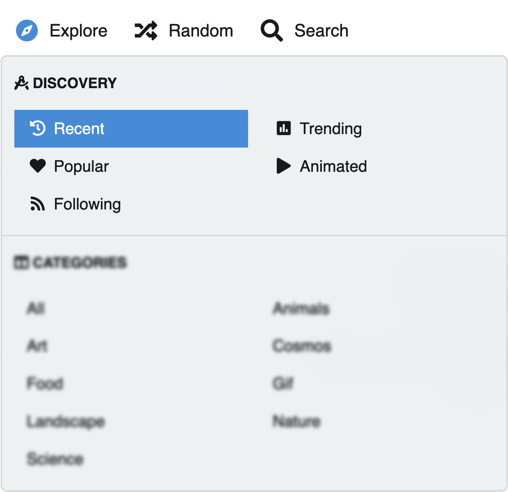
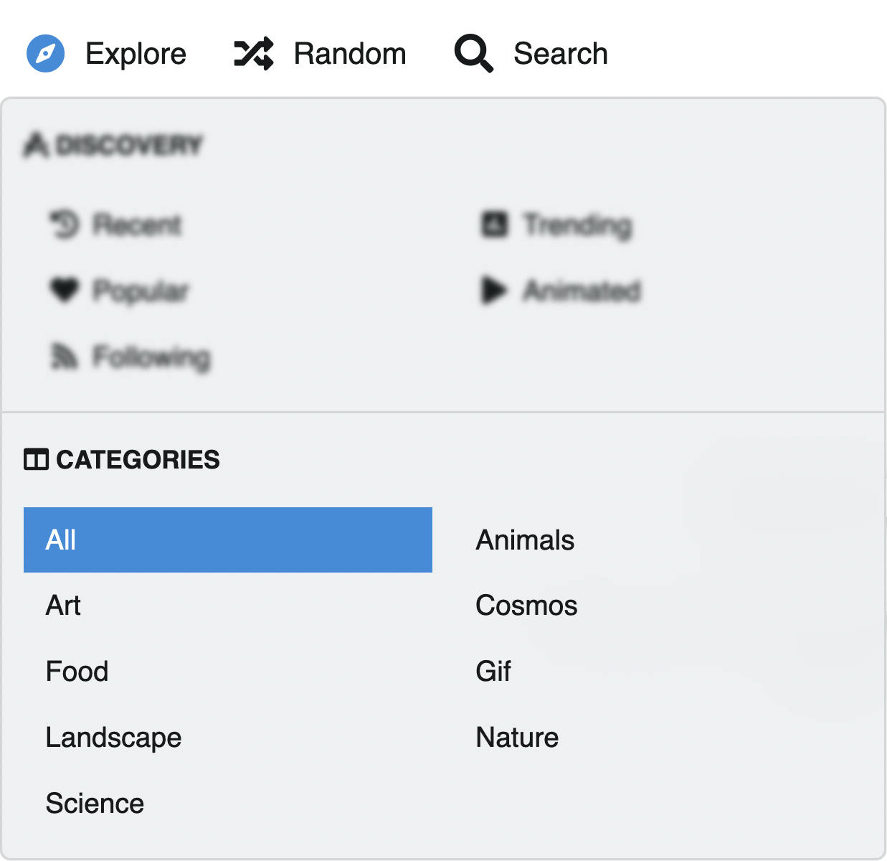

# Explore Menu

The explore menu allows you to discover and navigate content uploaded to Chevereto.

::: tip
The Explore functionality may require [ Login](../../user/account/login.md) or may be completely disabled by the system administrator.
:::

## Access explore

* In the top bar click the **Explore** button

## Discovery listings

Chevereto classifies content uploaded by users in listings of general interest under [ Discovery](discovery.md).

## Categories

Chevereto classifies content uploaded by categories under [ Categories](categories.md).

