# Actions

Requires [ Login](../../user/account/login.md) and [ Administration](https://v4-admin.chevereto.com/) for actions marked with (*).

## Activating the actions menu

To activate the actions menu, select content in the listing. When you do this, the actions menu will appear at the **top** of the listing.

The actions menu is contextual, appearing depending on the listing content and who is requesting that listing. User and administrator options will be activated as appropriate.

## Common Actions

In all listings you can select (or not) all items in them. Administrators can delete content in listings.

| Action           | Key   |
| ---------------- | ----- |
| Select all       | `.`   |
| Clear selection  | `Z`   |
| (*) Delete       | `Del` |

## General listings actions

General listings are those of **Explore** and **search results**. In this context, only the following actions will exist.

### Images

| Action                   | Key   |
| ------------------------ | ----- |
| Get codes                | `K`   |
| (*) Assign category      | `C`   |
| (*) Mark as unsafe       | `F`   |

## User listings

In user listings Chevereto allows the following options for content owners and administrators.

### Common shortcuts

| Action           | Key   |
| ---------------- | ----- |
| Edit             | `E`   |
| Share            | `S`   |
| Move to album    | `M`   |
| Delete           | `Del` |
| Select all       | `.`   |
| Clear selection  | `Z`   |

### Image shortcuts

| Action               | Key |
| -------------------- | --- |
| Get codes            | `K` |
| Assign category      | `C` |
| Mark as unsafe       | `F` |
| Like                 | `L` |
| Share                | `S` |

### Album shortcuts

| Action          | Key |
| --------------- | --- |
| Create album    | `A` |
| Upload to album | `P` |
| Create sub-album| `J` |

## Create album (A)

* Use the `A` command from your user profile to create new albums.

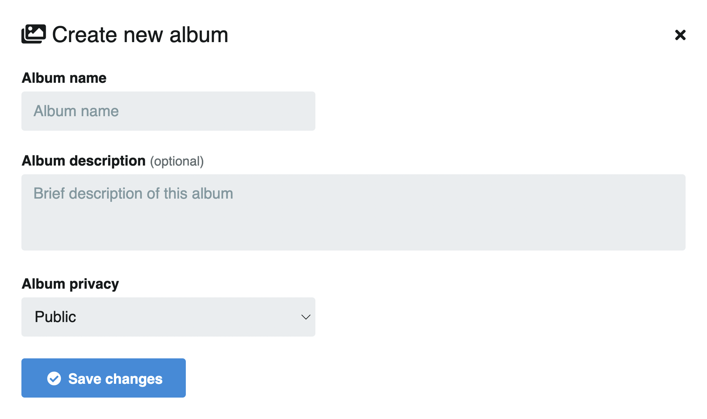

You can also create a new album with the button found under the profile search.

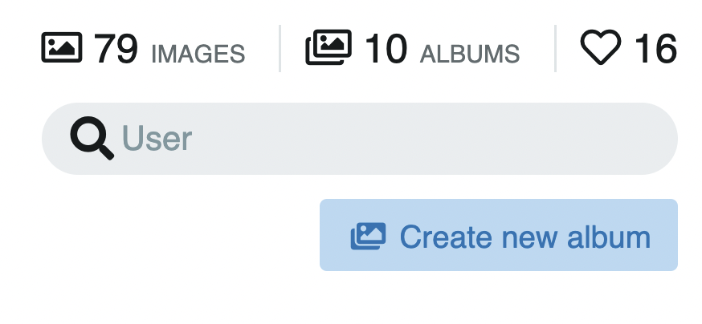

## Edit album (E)

* In your albums, click the album to edit and use the `E` command.

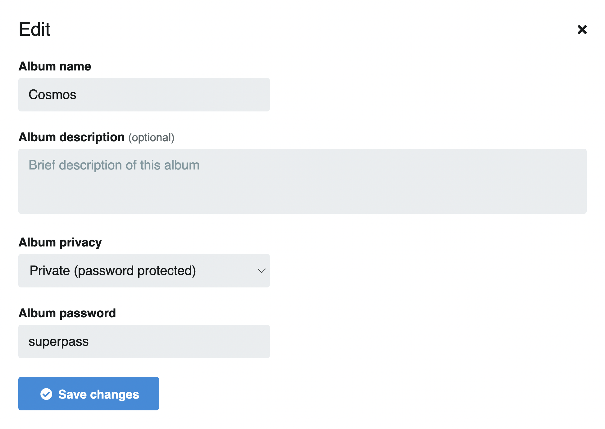

Or click the **Edit** button found to the left of the album.

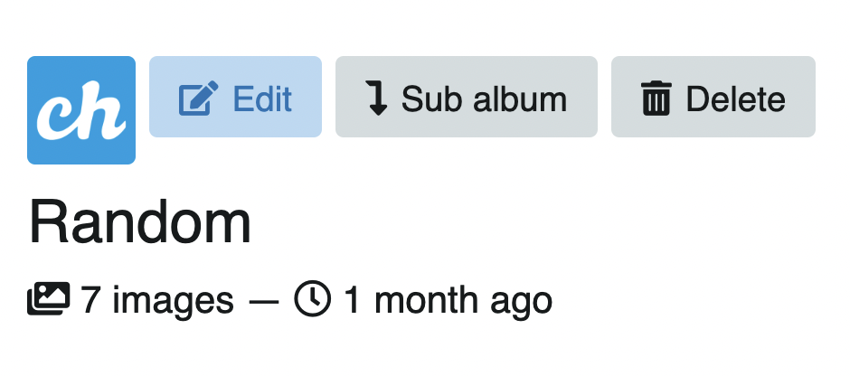

## Album Privacy

Select the privacy type for your album:

* Public
* Private (Only me)
* Private (Anyone with link)
* Private (Password protected)

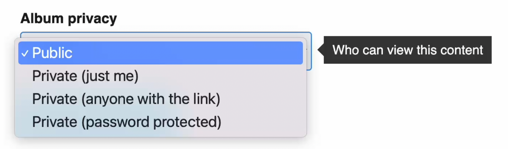

:::tip Private Images
Images will be private if they are within a private album or sub-album. Images on their own cannot be private.
:::

## Delete album (Del)

* Go to your albums and select one or more albums to delete.
* Use the `Del` command to delete and confirm.

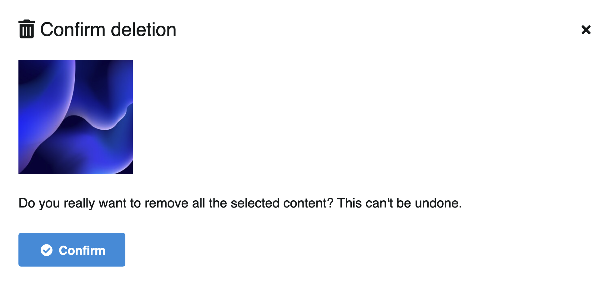

Or click the album and then click the **Delete** button found above the album title.

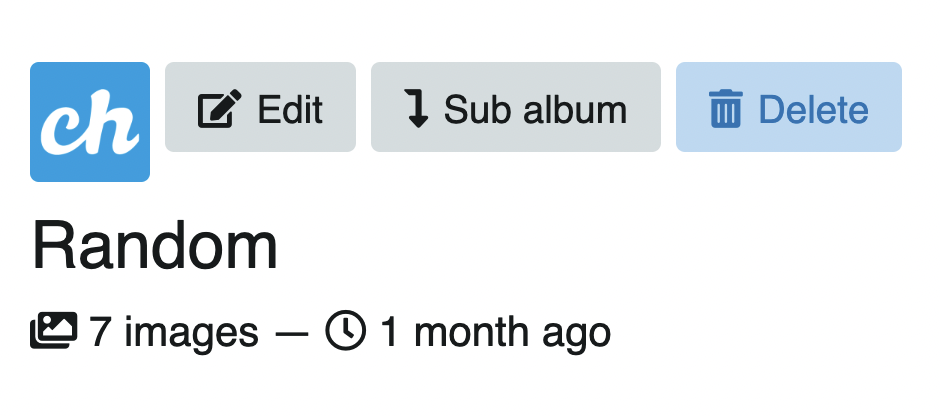

## Move to album (M)

* Select the images or albums.
* Use the `M` command and submit.

You can move to an existing album or create a new album. All images or albums will be moved to the album you choose.

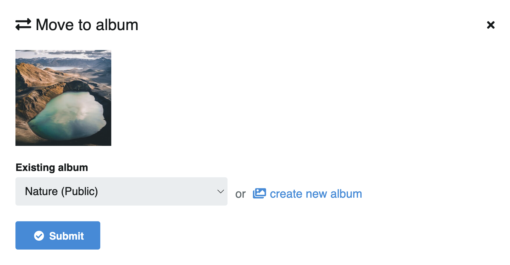

You can also find this option in the actions menu on the right.

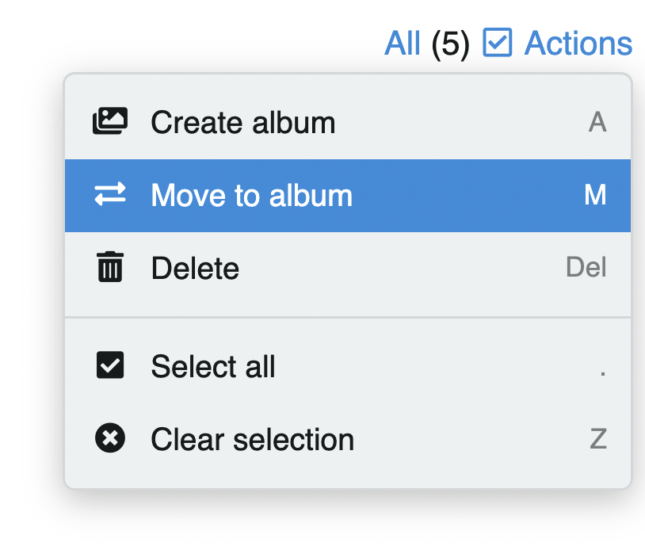

## Upload to album (P)

To add more content to the album:
* Click the **Upload to album** button or use the `P` shortcut in the album where you want to add more images.

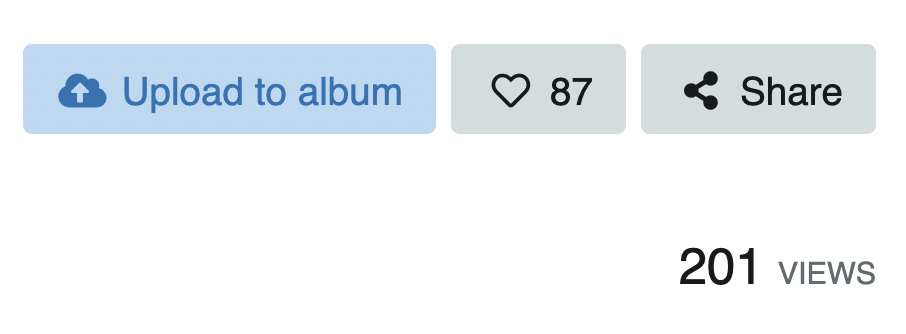

## Share album (S)

* Go to the album you want to share
* Use the `S` command and a box with the URL and social networks to share will open.

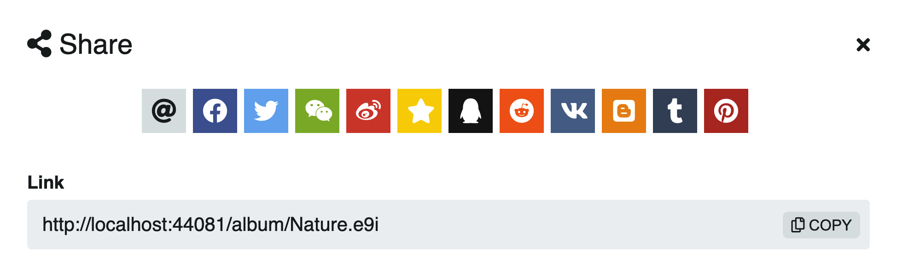

## Select all (.)

* Click **All** or use the `.` key

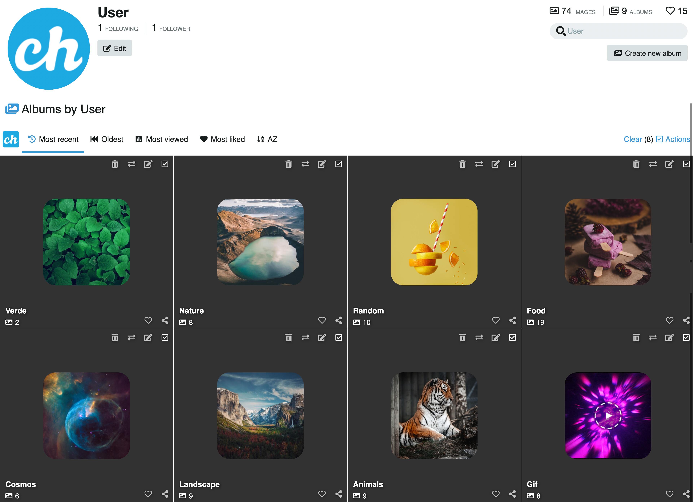

* To clear the selection, click **Clear** (on the right) or use the `Z` key. Or simply use the `J` shortcut

## Sub album (J)

* Click the **Sub-album** button found above the album title.

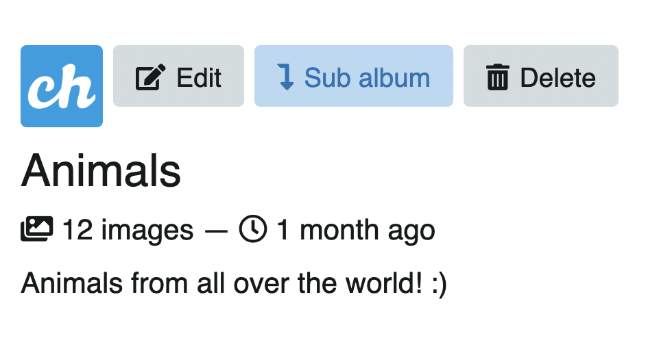

* Complete the information, privacy settings, and save the changes.

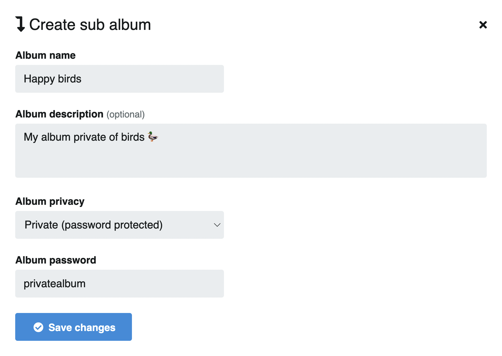

Find nested albums under the album description, in the **Sub albums** tab.

Once the new sub-album is created, you can add more images (P) or move existing ones from another album (M).

<video class="media-screen" width="100%" controls autoplay>
<source src="../../src/manual/settings/user/actions/sub-album.webm" type="video/webm">
</video>

## Album cover (H)

* To select an image for the album cover, click on the image of your preference and scroll down to the information. You will find the cover option next to the download icon. Click or use the **H** shortcut to select as cover.

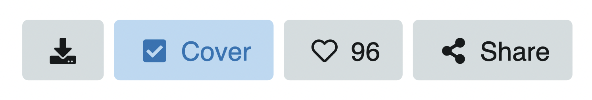

## Get codes (K)

* Select one or more images and use the `K` shortcut.

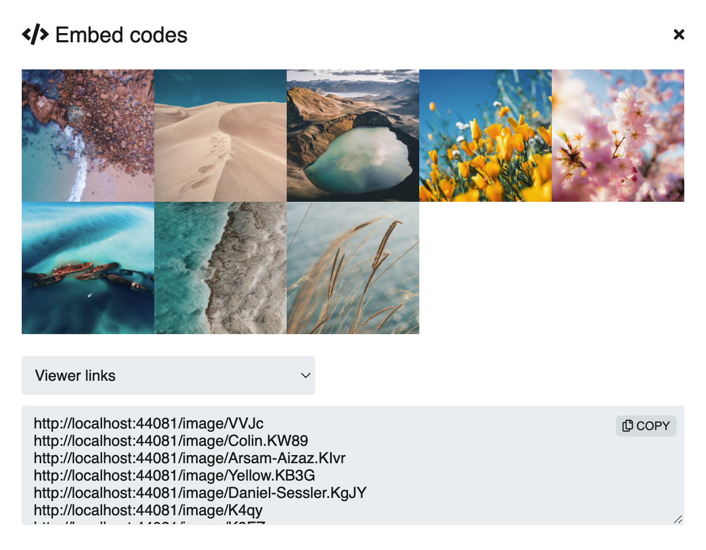

You can also find this option in the actions menu on the right.

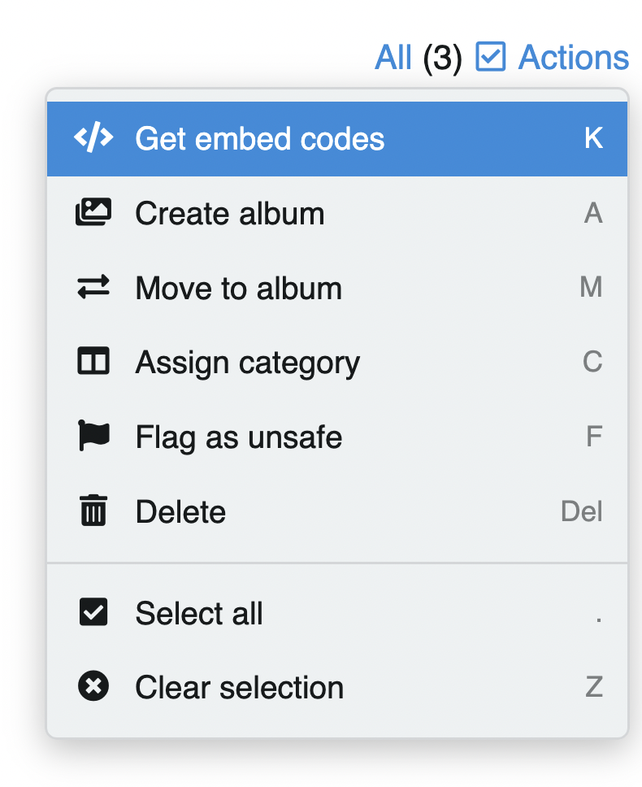

## Assign category (C)

* Select one or more images and use the `C` shortcut.
Or use the actions menu on the right.

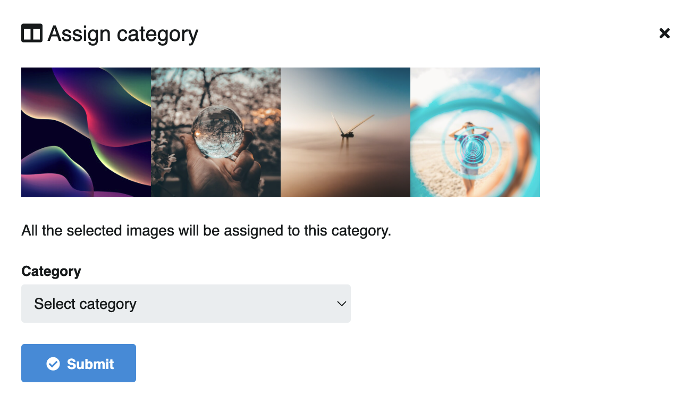

## Mark as unsafe (F)

* Select one or more images and use the `F` shortcut.
Or use the actions menu on the right.

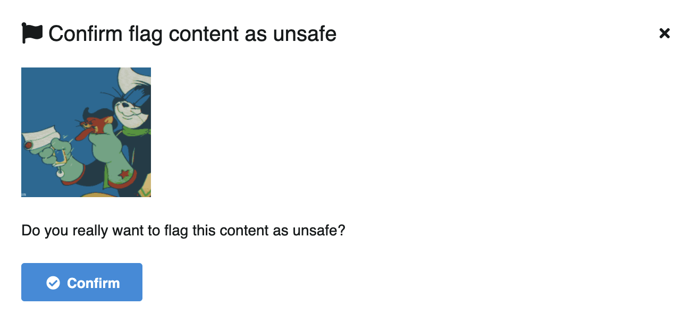

## Like (L)

A simple way to **Like** content is by clicking the heart icon of the image or album you are viewing.

* Go to the image you like and use the `L` command
* You can also find this option next to the **Share** button of the image

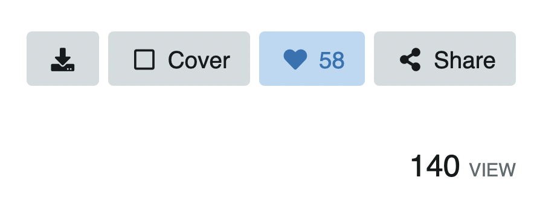

:::tip
[Image Information](../explorer/explore.md)
:::
