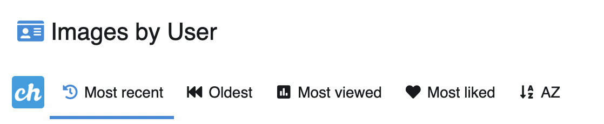

# Listados de contenido

Los listados de contenido se refieren a aquellos que listan contenido de un usuario, un album o una categoría.

Estos listados en Chevereto se pueden ordenar por:

* Más reciente
* Más antiguo
* Más visto
* Más me gusta
* A-Z
