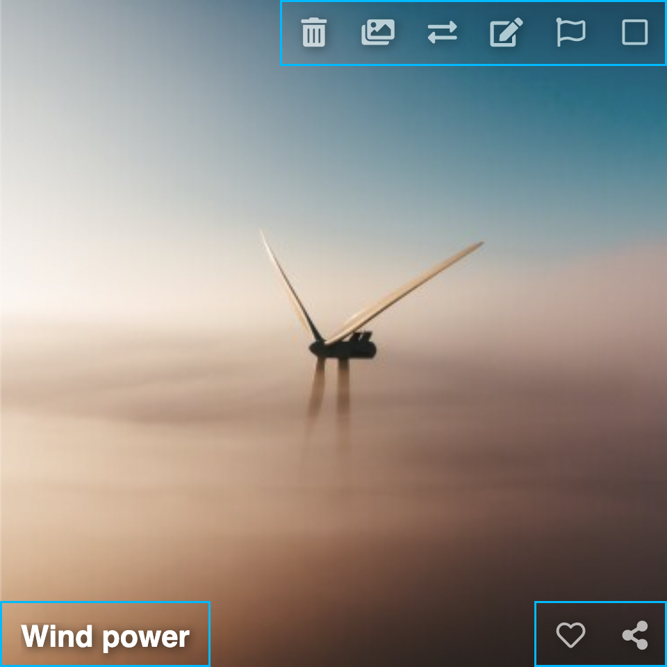

# Editing

Requires [Login](../../user/account/login.md).

The editing options in Chevereto allow you to edit content present in a listing. Depending on the context of the listing, different [Actions](actions.md) will be offered.

<video class="media-screen" width="100%" controls autoplay>
<source src="../../src/manual/settings/user/actions/actions.webm" type="video/webm">
</video>

## Multiple Editing

* To select all items in the listing click **All** or the `.` key
* Click the **checkbox** to select items
* **Right-click** (long press) to select items
* **Drag** selection with the cursor to select items
* Click **Actions**

## Individual Editing

Each item has its own editing options:

### Media

* Delete
* Create album
* Move
* Edit
* NSFW flag (unsafe content)
* Like
* Share

### Albums

* Delete
* Move
* Edit
* Like
* Share

<!--  -->
