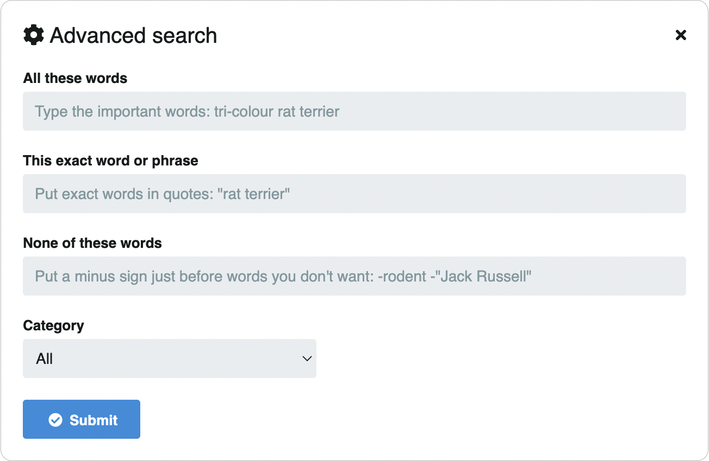

# Advanced search

In Chevereto you can perform advanced searches by combinations of keywords. You can also search by category and system administrators can search by IP address.

To perform an advanced search:

* Follow the steps of [Basic search](basic.md)
* Click on the **Gear** icon to open the **advanced search** window
* Complete and **submit the form**
