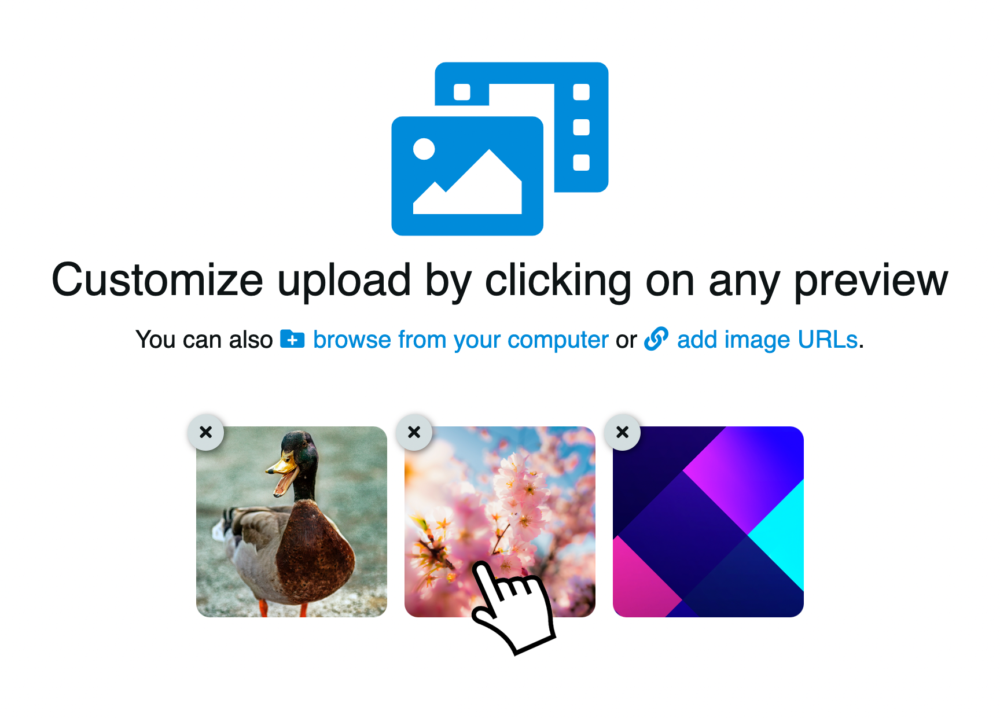
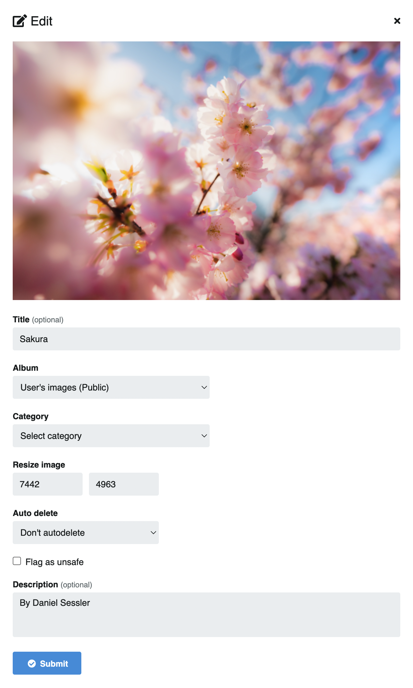

# Upload local

<video class="media-screen" width="100%" controls autoplay>
<source src="../../src/manual/upload/upload.webm" type="video/webm">
</video>

* Click on the **Upload** button located in the top bar
* **Select** the images to upload
* You can **drag and drop**
* Also **copy and paste**
* Optionally you can configure:
* Album (requires [Login](../../user/account/login.md))
* Category
* Expiration time
* NSFW flag (unsafe content)
* Click on the **Upload** button

## Advanced options

After selecting the images to upload you can edit any of them by clicking on the preview.

For **each file** to upload Chevereto allows you to adjust the following values:

* Title
* Album
* Category
* Resize image
* Auto delete
* NSFW flag (unsafe content)
* Description

## Post-upload

Once the upload is complete you can create a new album and access the embed codes.

### Create new album

* Click on the **Create new album** link (requires [Login](../../user/account/login.md))
* Complete and **submit the form**

### Embed codes

The embed codes will allow you to insert the content in other places. Chevereto provides codes in the following formats:

* BBCode
* HTML
* Markdown
