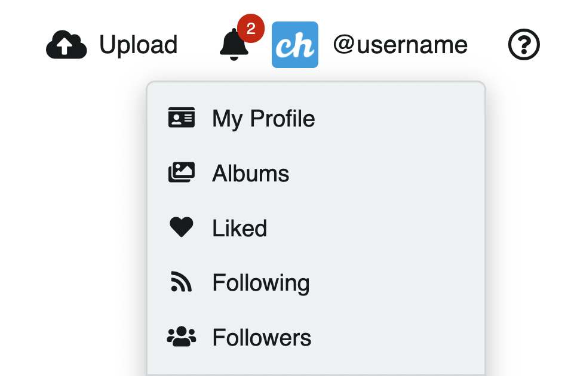
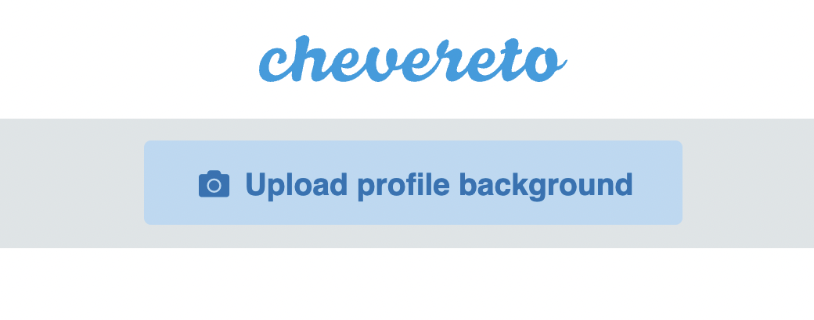
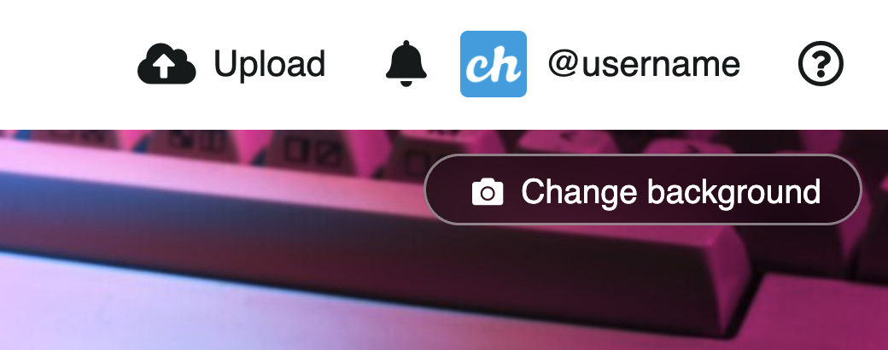
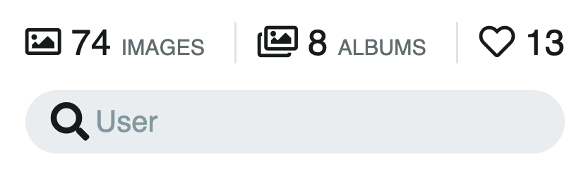

# User Profile

The user profile displays the content and (public) information of a user. The user profile is completely customizable and configurable.

<video class="media-screen" width="100%" controls autoplay>
<source src="../../src/manual/settings/user/content/social.webm" type="video/webm">
</video>

<!--  -->

## Access my profile

* In the top bar, click on the **User Icon** (requires [Login](../account/login.md))
* Click on **My profile**

## Profile background

To set the profile background:

* Click on the **Upload profile background** button (requires [Login](../account/login.md))

* If a background already exists, click on the **Change background** button (requires [Login](../account/login.md))

## User search

Use the user profile search to find content provided by the particular user.

## Follow user

Following users allows you to keep up with the content provided by other users. This content will be available in [Following](following.md).

To follow a user:

* Click on the **Follow** button (requires [Login](../account/login.md))
