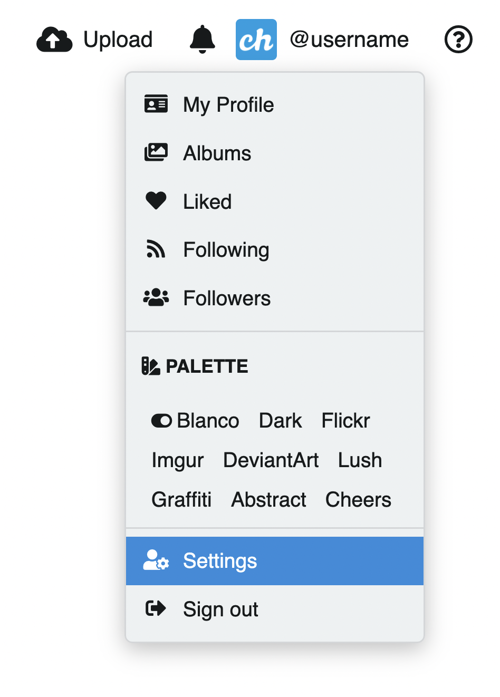
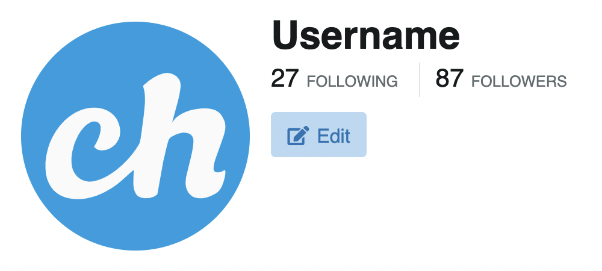
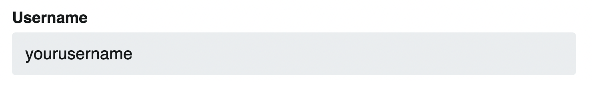
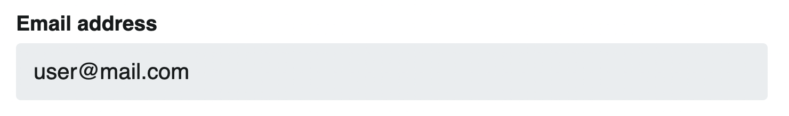
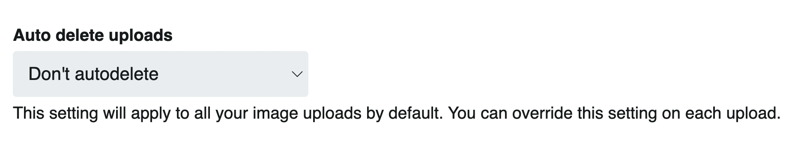
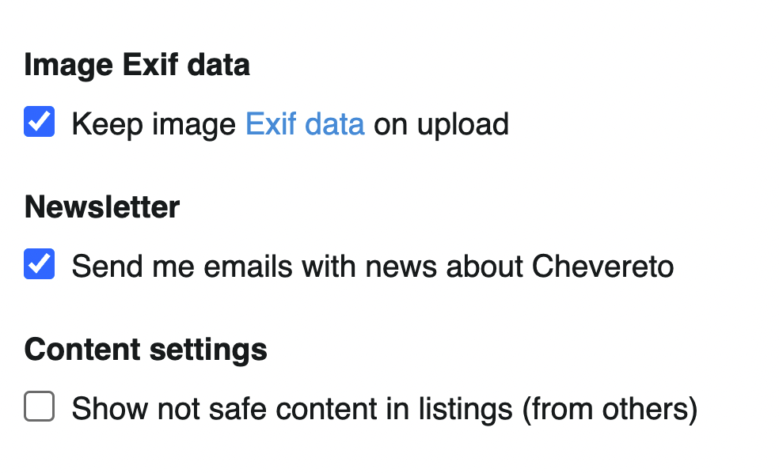
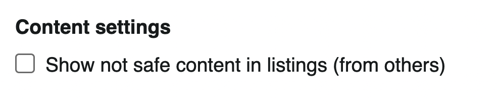
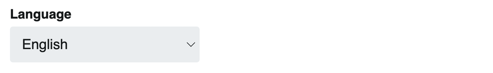
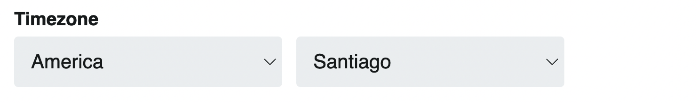
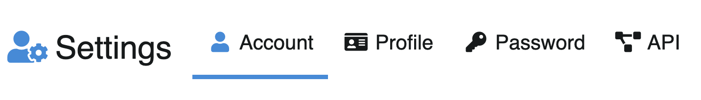

# Account

`/settings`

In this section you can adjust the general account settings.

## Access settings

To access account settings from **anywhere**:

* In the top bar, click on the **User Icon** (requires [Login](../account/login.md))
* Click on **Settings**

To access from **user profile**:

* Click on the **Edit** button

## Username

The username is the alphanumeric identifier of the account. This identifier is unique per user.

## Email

The email address associated with the user account. This email address will be used for all types of communications with the user.

## Auto delete uploads

You can configure automatic deletion of uploaded content. The range goes from 5 minutes to 1 year.

## Keep EXIF data

Enable or disable **Exif** data, these are metadata contained in images. When disabled, Chevereto will remove that information from the image file. The sub-option **Keep EXIF data on upload** controls whether EXIF is preserved at upload time.

::: tip Exif
Exif metadata provides specific information about images captured by a digital camera, including timestamp, exposure, location, etc.
:::

## Automatic metadata tags

When enabled, Chevereto will **assign camera model tag on upload** automatically based on the image EXIF data.

## Newsletter

Controls whether Chevereto sends you emails with news. Check **Send me emails with news about Chevereto** to opt in.

## Content settings

### Show not safe content in listings

When enabled, NSFW content (not safe for work) from other users will be visible in listings. When unchecked, unsafe content is hidden.

## Language

Chevereto automatically detects the language. Additionally, you can force the use of a language of your choice.

## Timezone

The timezone allows you to determine the user's local time.

<!--  -->
