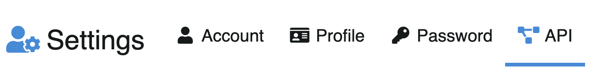

# API

`/settings/api`

In this section you can configure the user API key, which allows you to use the [Chevereto API](https://v4-docs.chevereto.com/developer/api/api-v1.html).



## API Key

The API key is auto-generated. A sample curl request is shown on the page:

```sh
curl --fail-with-body -X POST \
    -H "X-API-Key: YOUR_API_KEY" \
    -H "Content-Type: multipart/form-data" \
    -F "source=@image.jpeg" \
    http://yoursite/api/1/upload
```

Check the [API V1](https://v4-docs.chevereto.com/developer/api/api-v1.html) documentation to learn more.

### Viewing your key

The API key is displayed **only once** — store it in a secure location as it will be shown just once. After that, only a masked version is visible.

### Regen key

Click the **Regen key** button to invalidate the current key and generate a new one.
