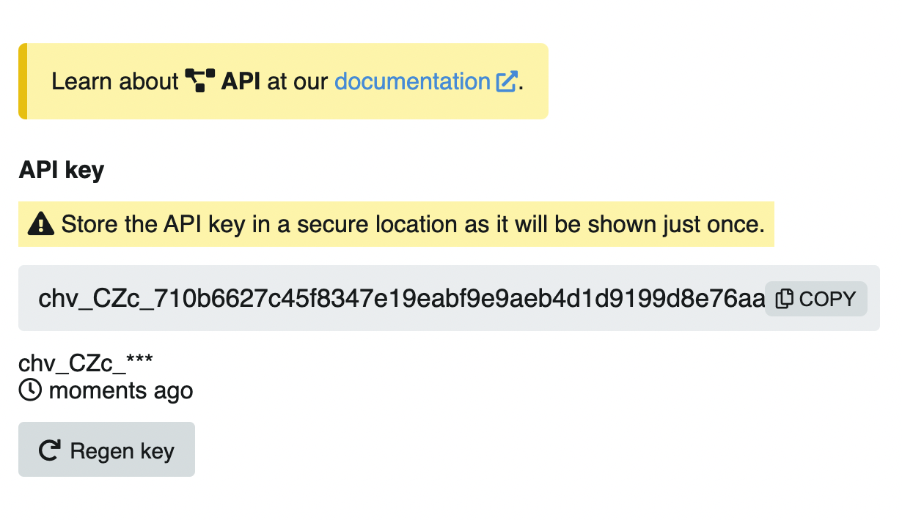
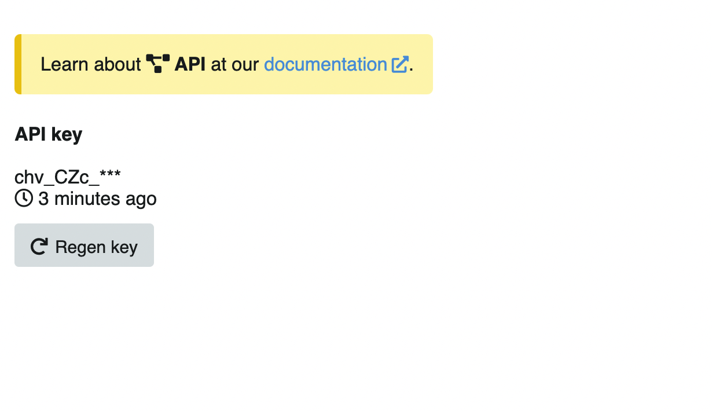

# API

`/settings/api`

In this section you can configure the user API key, which allows you to use the [Chevereto API](https://v4-docs.chevereto.com/developer/api/api-v1.html).

## API Key

### First time

When you access this section for the first time, the user API key will be generated automatically:

This key is displayed **only once**, save it in a safe place. For greater security, after you have seen the key, it will be displayed in the following way:

### Regenerate key

Click on the **Regenerate key** button to invalidate the current key and generate another one.
