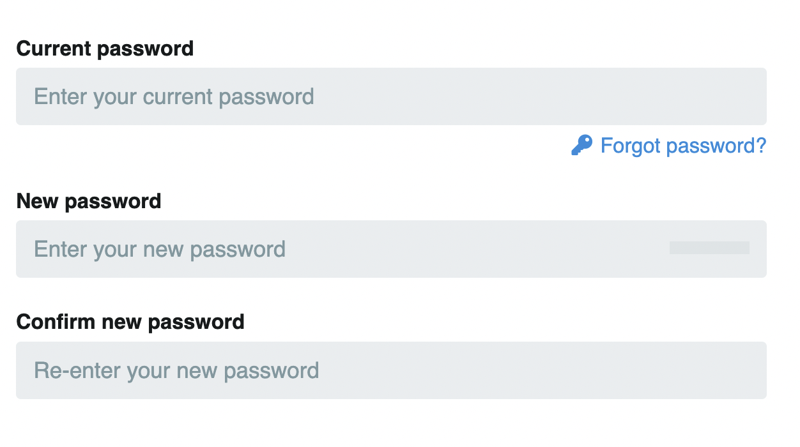
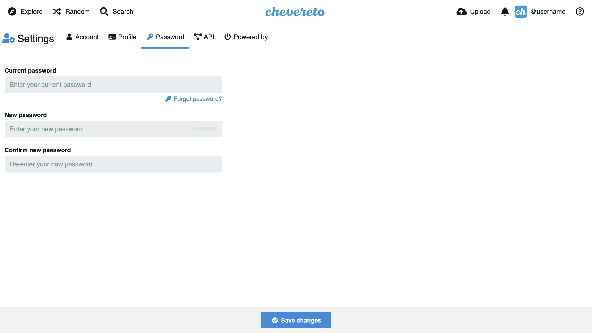

# Contraseña

`/settings/password`

En esta sección puede configurar su contraseña de cuenta. Si no recuerda su contraseña debe [ Recuperar contraseña](../account/password-forgot.md).

<!--  -->
<!--  -->
